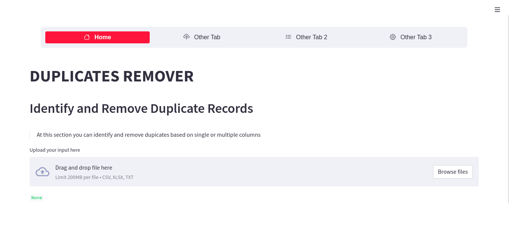

# Python-Sreamlit-Duplicate-Records-Finder-Remover

Streamlit is an open-source 
Python library that makes it easy to create and share beautiful,
custom web apps for machine learning and data science. In just a few minutes you can build and deploy powerful data apps.
[Streamlit Docs]: https://docs.streamlit.io/library/get-started

This app app can be used to analyse datasets that are thought to contain duplicates. The user should just drag and drop the file

#### To install relevant packages
Open your shell or terminal and install the relevant packages using the command below

```python
pip install -r requirements.txt
```
#### To run this Application
Open the root folder of the project and run the command below:

```python
streamlit run main.py
```

#### Dashboard Example: 
